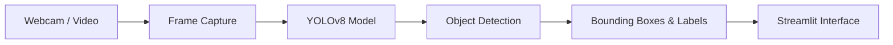

# 🎯 Real-Time Object Detection with YOLOv8

> **A real-time computer vision application that detects and localizes objects in live webcam streams and uploaded videos using the YOLOv8 deep learning model.**

<p align="center">


</p>

---

# 📖 Overview

**Real-Time Object Detection with YOLOv8** is a deep learning application that performs object detection on live webcam feeds and uploaded videos using the **YOLOv8 (You Only Look Once)** architecture.

The application identifies and localizes objects in real time by drawing bounding boxes, assigning class labels, and displaying confidence scores. Built with **Python**, **OpenCV**, **Ultralytics YOLOv8**, and **Streamlit**, it demonstrates practical computer vision techniques for interactive AI applications.

---

# 🎯 Objectives

* Detect multiple objects in real time.
* Demonstrate modern computer vision workflows.
* Provide an interactive web interface.
* Explore practical applications of deep learning.

---

# ✨ Features

* 🎥 Real-time webcam object detection
* 📹 Video upload and processing
* 📦 YOLOv8 deep learning model
* 🎯 Bounding box visualization
* 📊 Confidence score display
* ⚡ FPS monitoring
* 🖥 Interactive Streamlit interface
* 📂 COCO dataset support (80 object classes)
* 🔍 Optional object filtering
* 🧩 Extensible for custom-trained models

---

# 🏗 System Architecture



---

# 🔄 Detection Pipeline

```text
Video / Webcam
      │
      ▼
Frame Extraction
      │
      ▼
YOLOv8 Inference
      │
      ▼
Object Detection
      │
      ▼
Bounding Boxes
      │
      ▼
Confidence Scores
      │
      ▼
Annotated Output
```

---

# 🛠 Technology Stack

| Category             | Technology                 |
| -------------------- | -------------------------- |
| Programming Language | Python                     |
| Computer Vision      | OpenCV                     |
| Deep Learning        | YOLOv8 (Ultralytics)       |
| Interface            | Streamlit                  |
| Model                | YOLOv8 Nano (`yolov8n.pt`) |

---

# 🧠 AI Model

The application uses the **YOLOv8 Nano** model trained on the **COCO dataset**, enabling detection of **80 common object categories** including:

* Person
* Car
* Bicycle
* Dog
* Cat
* Chair
* Bottle
* Laptop
* Cell Phone
* Bus
* Motorcycle
* Truck
* And many more.

---

# 📂 Project Structure

```text
RealTimeObjectDetection/

├── app.py                 # Streamlit application
├── yolov8n.pt             # Pre-trained YOLOv8 model
├── requirements.txt       # Dependencies
├── runtime.txt            # Deployment configuration
└── README.md
```

---

# 🚀 Installation

Clone the repository

```bash
git clone https://github.com/sajidrehman2/RealTimeObjectDetection.git

cd RealTimeObjectDetection
```

Create a virtual environment

```bash
python -m venv venv
```

Activate it

Windows

```bash
venv\Scripts\activate
```

Linux/macOS

```bash
source venv/bin/activate
```

Install dependencies

```bash
pip install -r requirements.txt
```

---

# ▶ Running the Application

Start the Streamlit application

```bash
streamlit run app.py
```

Open your browser

```text
http://localhost:8501
```

---

# 📋 How It Works

1. Start the application.
2. Choose a webcam or upload a video.
3. Each frame is processed by the YOLOv8 model.
4. Objects are detected and classified.
5. Bounding boxes and confidence scores are displayed.
6. The annotated output is shown in real time.

---

# 📈 Applications

* Autonomous systems
* Smart surveillance
* Traffic monitoring
* Robotics
* Retail analytics
* Industrial inspection
* Educational computer vision demonstrations
* AI research and prototyping

---

# 🚧 Future Improvements

* Object tracking (ByteTrack or DeepSORT)
* Instance segmentation (YOLOv8-Seg)
* Pose estimation
* Custom model training
* GPU optimization
* Image upload support
* Object counting
* Region-of-interest analytics
* Docker deployment

---

# 🤝 Contributing

Contributions are welcome.

Feel free to fork the repository, improve the application, and submit pull requests.

---

# 👨‍💻 Author

**Sajid Rehman**

**AI & Data Science Engineer**

Areas of Interest:

* Computer Vision
* Deep Learning
* Artificial Intelligence
* Machine Learning
* Python Development
* Object Detection
* YOLO
* OpenCV

GitHub: **https://github.com/sajidrehman2**

---

# ⭐ Support

If you found this project useful, please consider giving it a **Star ⭐**.

Your support encourages future improvements and helps others discover the project.

---

# 📜 License

This project is licensed under the **MIT License**.

---

<p align="center">

**Building intelligent computer vision solutions with modern deep learning technologies.**

</p>
